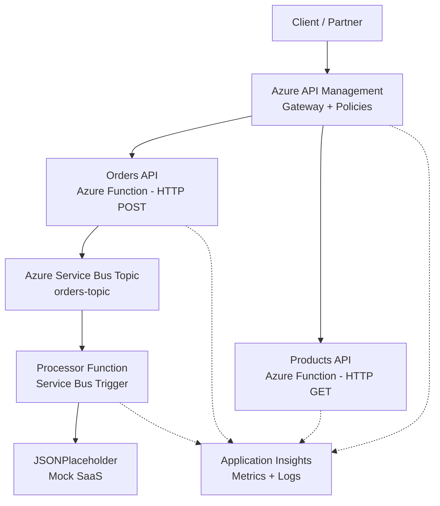
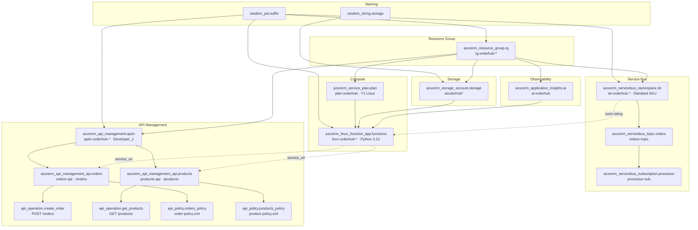

# OrderHub-APIM

Enterprise API Management platform for order processing — built on Azure with Terraform IaC, Azure Functions microservices, Service Bus async messaging, and full observability.

## Architecture



## Tech Stack

| Component | Technology | Purpose |
|---|---|---|
| Cloud | Azure (Free tier) | Hosting platform |
| API Gateway | Azure API Management (Developer SKU) | Rate limiting, caching, retry, transformation |
| Microservices | Azure Functions (Python 3.12, v2 model) | Sync HTTP APIs + async processor |
| Async Messaging | Azure Service Bus (Standard SKU) | Topic/Subscription pub/sub |
| IaC | Terraform (azurerm ~> 4.0) | Infrastructure as Code |
| Observability | Application Insights | Metrics, traces, logs, dashboards |
| Auth | Subscription Keys + JWT reference | API security |
| Mock SaaS | JSONPlaceholder | External integration demo |

## APIM Policies

### Orders API
| Policy | Section | Behavior |
|---|---|---|
| `rate-limit` | inbound | 50 calls / 60 seconds per subscription |
| `cache-lookup` | inbound | Cache by query parameters |
| `retry` | backend | 3 retries, 2s interval on 500/503 |
| `cache-store` | outbound | Cache for 300 seconds |
| `set-header` | outbound | Adds `X-Processed-By: APIM-OrderHub` |

### Products API
| Policy | Section | Behavior |
|---|---|---|
| `rate-limit` | inbound | 100 calls / 60 seconds per subscription |
| `cache-lookup` | inbound | Cache by query parameters |
| `cache-store` | outbound | Cache for 600 seconds |
| `set-header` | outbound | Adds `X-Processed-By: APIM-OrderHub` |

JWT validation is included as a commented reference in the Orders policy XML — ready to wire to Entra ID.

## Prerequisites

- Azure account ([free tier](https://azure.microsoft.com/free))
- [Terraform](https://developer.hashicorp.com/terraform/downloads) >= 1.0
- [Azure CLI](https://learn.microsoft.com/cli/azure/install-azure-cli)
- Python 3.12
- [Azure Functions Core Tools](https://learn.microsoft.com/azure/azure-functions/functions-run-local) v4

## Quick Start

### 1. Login to Azure

```bash
az login
```

### 2. Deploy Infrastructure

```bash
cd terraform
terraform init
terraform apply
```

Note: APIM provisioning takes ~30-45 minutes on Developer SKU. Other resources deploy in a few minutes.

### 3. Deploy Functions

```bash
cd functions
func azure functionapp publish $(terraform -chdir=../terraform output -raw function_app_name)
```

### 4. Get APIM Gateway URL

```bash
terraform -chdir=terraform output apim_gateway_url
```

## API Reference

All requests go through the APIM gateway. Include your subscription key in every request.

### List Products

```bash
curl -X GET "https://{apim-gateway-url}/products/products" \
  -H "Ocp-Apim-Subscription-Key: {your-subscription-key}"
```

**Response (200):**
```json
[
  {"id": "PROD-001", "name": "Wireless Mouse", "price": 29.99},
  {"id": "PROD-002", "name": "Mechanical Keyboard", "price": 89.99},
  {"id": "PROD-003", "name": "USB-C Hub", "price": 49.99}
]
```

### Create Order

```bash
curl -X POST "https://{apim-gateway-url}/orders/orders" \
  -H "Ocp-Apim-Subscription-Key: {your-subscription-key}" \
  -H "Content-Type: application/json" \
  -d '{
    "customer_name": "João Silva",
    "product_id": "PROD-001",
    "quantity": 2
  }'
```

**Response (202 Accepted):**
```json
{
  "order_id": "a1b2c3d4-...",
  "status": "pending"
}
```

## Async Flow

1. Client POSTs to `/orders/orders` via APIM gateway
2. APIM applies rate limiting, caching, and subscription key check
3. Request forwards to `create_order` Azure Function
4. Function validates input, generates order ID, publishes event to `orders-topic` (Service Bus)
5. Returns `202 Accepted` immediately (synchronous response)
6. `process_order` function triggers on `processor-sub` subscription
7. Processor POSTs order data to JSONPlaceholder (mock SaaS)
8. Success/failure logged to Application Insights

## Observability

After deploying, check these Azure Portal blades:

| Where to look | What you see |
|---|---|
| **APIM > Analytics** | Request count, latency, error rate by API |
| **APIM > Logs** | Individual request traces with policy execution |
| **Application Insights > Live Metrics** | Real-time request stream |
| **Application Insights > Transaction Search** | End-to-end traces: HTTP → Service Bus → SaaS |
| **Application Insights > Failures** | Failed requests and dependency calls |
| **Service Bus > Overview** | Active messages, dead-letter count |

## Terraform Dependency Graph



## Project Structure

```
orderhub-apim/
├── terraform/
│   ├── providers.tf          # Azure provider + Terraform version
│   ├── variables.tf          # Parameterized inputs (location, email, prefix)
│   ├── main.tf               # All Azure resources
│   ├── outputs.tf            # APIM URL, Function URL, App Insights key
│   └── policies/
│       ├── order-policy.xml  # Rate limit, cache, retry, JWT ref
│       └── product-policy.xml# Rate limit, cache
├── functions/
│   ├── host.json             # Functions runtime config
│   ├── requirements.txt      # Python dependencies
│   └── function_app.py       # All 3 functions (v2 programming model)
├── .gitignore
└── README.md
```

## Cleanup

```bash
cd terraform
terraform destroy
```
