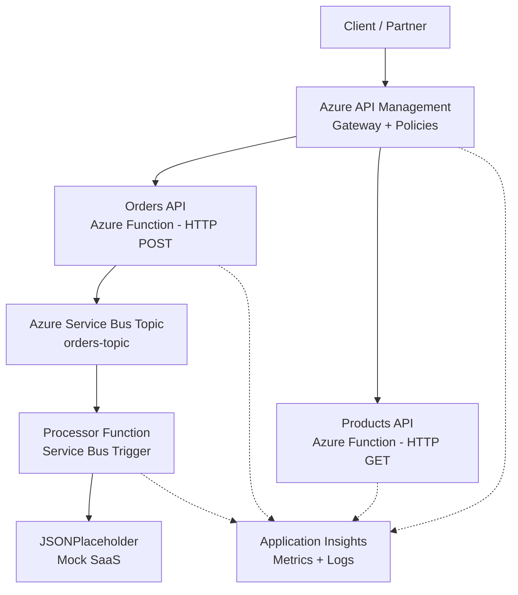

# OrderHub-APIM Implementation Plan

> **For agentic workers:** REQUIRED SUB-SKILL: Use superpowers:subagent-driven-development (recommended) or superpowers:executing-plans to implement this plan task-by-task. Steps use checkbox (`- [ ]`) syntax for tracking.

**Goal:** Build a complete Azure APIM portfolio project with Terraform IaC, Python Azure Functions (sync + async), Service Bus integration, gateway policies, and observability.

**Architecture:** APIM fronts two HTTP Azure Functions (Orders POST, Products GET). Orders publishes to a Service Bus Topic; a third function triggers on the subscription and calls a mock SaaS. All infra is Terraform. App Insights provides observability.

**Tech Stack:** Terraform (azurerm ~> 4.0), Python 3.12, Azure Functions v2 programming model, Azure Service Bus (Standard), Azure API Management (Developer SKU), Application Insights.

---

### Task 1: Project Scaffolding

**Files:**
- Create: `.gitignore`
- Create: `terraform/` (empty dir structure)
- Create: `functions/` (empty dir structure)

- [ ] **Step 1: Create `.gitignore`**

```gitignore
# Terraform
terraform/.terraform/
terraform/*.tfstate
terraform/*.tfstate.backup
terraform/*.tfplan
terraform/.terraform.lock.hcl

# Python
__pycache__/
*.pyc
*.pyo
.venv/
venv/

# Azure Functions
functions/local.settings.json
functions/.python_packages/

# IDE
.vscode/
.idea/

# OS
.DS_Store
```

- [ ] **Step 2: Create directory structure**

Run:
```bash
mkdir -p terraform/policies functions
```

- [ ] **Step 3: Commit**

```bash
git add .gitignore
git commit -m "chore: add .gitignore for Terraform, Python, and Azure Functions"
```

---

### Task 2: Terraform Providers and Variables

**Files:**
- Create: `terraform/providers.tf`
- Create: `terraform/variables.tf`

- [ ] **Step 1: Create `terraform/providers.tf`**

```hcl
terraform {
  required_version = ">= 1.0"
  required_providers {
    azurerm = {
      source  = "hashicorp/azurerm"
      version = "~> 4.0"
    }
    random = {
      source  = "hashicorp/random"
      version = "~> 3.0"
    }
  }
}

provider "azurerm" {
  features {}
}
```

- [ ] **Step 2: Create `terraform/variables.tf`**

```hcl
variable "location" {
  description = "Azure region for all resources"
  type        = string
  default     = "brazilsouth"
}

variable "publisher_email" {
  description = "Email for APIM publisher"
  type        = string
  default     = "admin@orderhub.com"
}

variable "prefix" {
  description = "Prefix for resource names"
  type        = string
  default     = "orderhub"
}
```

- [ ] **Step 3: Validate Terraform config**

Run:
```bash
cd terraform && terraform init && terraform validate
```

Expected: "Success! The configuration is valid."

- [ ] **Step 4: Commit**

```bash
git add terraform/providers.tf terraform/variables.tf
git commit -m "feat: add Terraform providers and variables"
```

---

### Task 3: Terraform Core Resources (Resource Group, Storage, App Insights)

**Files:**
- Create: `terraform/main.tf`

- [ ] **Step 1: Create `terraform/main.tf` with foundational resources**

```hcl
# Random suffixes for globally unique names
resource "random_pet" "suffix" {}

resource "random_string" "storage" {
  length  = 8
  special = false
  upper   = false
}

# Resource Group
resource "azurerm_resource_group" "rg" {
  name     = "rg-${var.prefix}-${random_pet.suffix.id}"
  location = var.location
}

# Storage Account (required by Azure Functions)
resource "azurerm_storage_account" "storage" {
  name                     = "st${var.prefix}${random_string.storage.result}"
  resource_group_name      = azurerm_resource_group.rg.name
  location                 = azurerm_resource_group.rg.location
  account_tier             = "Standard"
  account_replication_type = "LRS"
}

# Application Insights (observability)
resource "azurerm_application_insights" "ai" {
  name                = "ai-${var.prefix}"
  location            = azurerm_resource_group.rg.location
  resource_group_name = azurerm_resource_group.rg.name
  application_type    = "web"
}
```

- [ ] **Step 2: Validate**

Run:
```bash
cd terraform && terraform validate
```

Expected: "Success! The configuration is valid."

- [ ] **Step 3: Commit**

```bash
git add terraform/main.tf
git commit -m "feat: add resource group, storage account, and app insights"
```

---

### Task 4: Terraform Service Bus (Standard SKU + Topic + Subscription)

**Files:**
- Modify: `terraform/main.tf` (append after App Insights block)

- [ ] **Step 1: Add Service Bus resources to `terraform/main.tf`**

Append to end of `terraform/main.tf`:

```hcl
# Service Bus Namespace (Standard SKU for Topics support)
resource "azurerm_servicebus_namespace" "sb" {
  name                = "sb-${var.prefix}-${random_pet.suffix.id}"
  location            = azurerm_resource_group.rg.location
  resource_group_name = azurerm_resource_group.rg.name
  sku                 = "Standard"
}

# Service Bus Topic
resource "azurerm_servicebus_topic" "orders" {
  name         = "orders-topic"
  namespace_id = azurerm_servicebus_namespace.sb.id
}

# Service Bus Subscription (processor listens here)
resource "azurerm_servicebus_subscription" "processor" {
  name               = "processor-sub"
  topic_id           = azurerm_servicebus_topic.orders.id
  max_delivery_count = 5
}
```

- [ ] **Step 2: Validate**

Run:
```bash
cd terraform && terraform validate
```

Expected: "Success! The configuration is valid."

- [ ] **Step 3: Commit**

```bash
git add terraform/main.tf
git commit -m "feat: add Service Bus namespace, topic, and subscription"
```

---

### Task 5: Terraform Azure Functions (Service Plan + Function App)

**Files:**
- Modify: `terraform/main.tf` (append after Service Bus block)

- [ ] **Step 1: Add Functions resources to `terraform/main.tf`**

Append to end of `terraform/main.tf`:

```hcl
# Service Plan (Consumption - free tier)
resource "azurerm_service_plan" "plan" {
  name                = "plan-${var.prefix}"
  location            = azurerm_resource_group.rg.location
  resource_group_name = azurerm_resource_group.rg.name
  os_type             = "Linux"
  sku_name            = "Y1"
}

# Linux Function App
resource "azurerm_linux_function_app" "functions" {
  name                       = "func-${var.prefix}-${random_pet.suffix.id}"
  location                   = azurerm_resource_group.rg.location
  resource_group_name        = azurerm_resource_group.rg.name
  service_plan_id            = azurerm_service_plan.plan.id
  storage_account_name       = azurerm_storage_account.storage.name
  storage_account_access_key = azurerm_storage_account.storage.primary_access_key

  site_config {
    application_stack {
      python_version = "3.12"
    }
    application_insights_key               = azurerm_application_insights.ai.instrumentation_key
    application_insights_connection_string = azurerm_application_insights.ai.connection_string
  }

  app_settings = {
    "FUNCTIONS_WORKER_RUNTIME"       = "python"
    "AzureWebJobsFeatureFlags"       = "EnableWorkerIndexing"
    "SERVICE_BUS_CONNECTION_STRING"   = azurerm_servicebus_namespace.sb.default_primary_connection_string
  }
}
```

- [ ] **Step 2: Validate**

Run:
```bash
cd terraform && terraform validate
```

Expected: "Success! The configuration is valid."

- [ ] **Step 3: Commit**

```bash
git add terraform/main.tf
git commit -m "feat: add service plan and Linux function app"
```

---

### Task 6: Terraform APIM (Gateway + APIs + Policies)

**Files:**
- Modify: `terraform/main.tf` (append after Functions block)
- Create: `terraform/policies/order-policy.xml`
- Create: `terraform/policies/product-policy.xml`

- [ ] **Step 1: Create `terraform/policies/order-policy.xml`**

```xml
<policies>
  <inbound>
    <base />
    <rate-limit calls="50" renewal-period="60" />
    <cache-lookup vary-by-query-parameter="*" />
    <!--
      JWT Validation (uncommented when using Entra ID / Azure AD):

      To enable, register an app in Entra ID, then replace the values below:
      - openid-config url: https://login.microsoftonline.com/{tenant-id}/v2.0/.well-known/openid-configuration
      - audience: your app's client ID

      <validate-jwt header-name="Authorization" failed-validation-httpcode="401"
                     failed-validation-error-message="Unauthorized">
        <openid-config url="https://login.microsoftonline.com/{tenant-id}/v2.0/.well-known/openid-configuration" />
        <audiences>
          <audience>{your-client-id}</audience>
        </audiences>
      </validate-jwt>
    -->
  </inbound>
  <backend>
    <base />
    <retry condition="@(context.Response.StatusCode == 500 || context.Response.StatusCode == 503)"
           count="3" interval="2" first-fast-retry="false" />
  </backend>
  <outbound>
    <base />
    <cache-store duration="300" />
    <set-header name="X-Processed-By" exists-action="override">
      <value>APIM-OrderHub</value>
    </set-header>
  </outbound>
  <on-error>
    <base />
  </on-error>
</policies>
```

- [ ] **Step 2: Create `terraform/policies/product-policy.xml`**

```xml
<policies>
  <inbound>
    <base />
    <rate-limit calls="100" renewal-period="60" />
    <cache-lookup vary-by-query-parameter="*" />
  </inbound>
  <backend>
    <base />
  </backend>
  <outbound>
    <base />
    <cache-store duration="600" />
    <set-header name="X-Processed-By" exists-action="override">
      <value>APIM-OrderHub</value>
    </set-header>
  </outbound>
  <on-error>
    <base />
  </on-error>
</policies>
```

- [ ] **Step 3: Add APIM resources to `terraform/main.tf`**

Append to end of `terraform/main.tf`:

```hcl
# API Management
resource "azurerm_api_management" "apim" {
  name                = "apim-${var.prefix}-${random_pet.suffix.id}"
  location            = azurerm_resource_group.rg.location
  resource_group_name = azurerm_resource_group.rg.name
  publisher_name      = "OrderHub Team"
  publisher_email     = var.publisher_email
  sku_name            = "Developer_1"
}

# Orders API
resource "azurerm_api_management_api" "orders" {
  name                = "orders-api"
  resource_group_name = azurerm_resource_group.rg.name
  api_management_name = azurerm_api_management.apim.name
  revision            = "1"
  display_name        = "Orders API"
  path                = "orders"
  protocols           = ["https"]
  service_url         = "https://${azurerm_linux_function_app.functions.default_hostname}/api"
}

resource "azurerm_api_management_api_operation" "create_order" {
  operation_id        = "create-order"
  api_name            = azurerm_api_management_api.orders.name
  api_management_name = azurerm_api_management.apim.name
  resource_group_name = azurerm_resource_group.rg.name
  display_name        = "Create Order"
  method              = "POST"
  url_template        = "/orders"
}

resource "azurerm_api_management_api_policy" "orders_policy" {
  api_name            = azurerm_api_management_api.orders.name
  api_management_name = azurerm_api_management.apim.name
  resource_group_name = azurerm_resource_group.rg.name
  xml_content         = file("${path.module}/policies/order-policy.xml")
}

# Products API
resource "azurerm_api_management_api" "products" {
  name                = "products-api"
  resource_group_name = azurerm_resource_group.rg.name
  api_management_name = azurerm_api_management.apim.name
  revision            = "1"
  display_name        = "Products API"
  path                = "products"
  protocols           = ["https"]
  service_url         = "https://${azurerm_linux_function_app.functions.default_hostname}/api"
}

resource "azurerm_api_management_api_operation" "get_products" {
  operation_id        = "get-products"
  api_name            = azurerm_api_management_api.products.name
  api_management_name = azurerm_api_management.apim.name
  resource_group_name = azurerm_resource_group.rg.name
  display_name        = "Get Products"
  method              = "GET"
  url_template        = "/products"
}

resource "azurerm_api_management_api_policy" "products_policy" {
  api_name            = azurerm_api_management_api.products.name
  api_management_name = azurerm_api_management.apim.name
  resource_group_name = azurerm_resource_group.rg.name
  xml_content         = file("${path.module}/policies/product-policy.xml")
}
```

- [ ] **Step 4: Validate**

Run:
```bash
cd terraform && terraform validate
```

Expected: "Success! The configuration is valid."

- [ ] **Step 5: Commit**

```bash
git add terraform/main.tf terraform/policies/order-policy.xml terraform/policies/product-policy.xml
git commit -m "feat: add APIM gateway, APIs, operations, and policies"
```

---

### Task 7: Terraform Outputs

**Files:**
- Create: `terraform/outputs.tf`

- [ ] **Step 1: Create `terraform/outputs.tf`**

```hcl
output "resource_group_name" {
  value = azurerm_resource_group.rg.name
}

output "apim_gateway_url" {
  value = azurerm_api_management.apim.gateway_url
}

output "function_app_url" {
  value = "https://${azurerm_linux_function_app.functions.default_hostname}"
}

output "function_app_name" {
  value = azurerm_linux_function_app.functions.name
}

output "app_insights_instrumentation_key" {
  value     = azurerm_application_insights.ai.instrumentation_key
  sensitive = true
}

output "app_insights_connection_string" {
  value     = azurerm_application_insights.ai.connection_string
  sensitive = true
}
```

- [ ] **Step 2: Validate**

Run:
```bash
cd terraform && terraform validate
```

Expected: "Success! The configuration is valid."

- [ ] **Step 3: Commit**

```bash
git add terraform/outputs.tf
git commit -m "feat: add Terraform outputs for APIM, Functions, and App Insights"
```

---

### Task 8: Azure Functions — host.json and requirements.txt

**Files:**
- Create: `functions/host.json`
- Create: `functions/requirements.txt`

- [ ] **Step 1: Create `functions/host.json`**

```json
{
  "version": "2.0",
  "logging": {
    "applicationInsights": {
      "samplingSettings": {
        "isEnabled": true,
        "excludedTypes": "Request"
      }
    }
  },
  "extensionBundle": {
    "id": "Microsoft.Azure.Functions.ExtensionBundle",
    "version": "[4.*, 5.0.0)"
  }
}
```

- [ ] **Step 2: Create `functions/requirements.txt`**

```
azure-functions
azure-servicebus
requests
```

- [ ] **Step 3: Commit**

```bash
git add functions/host.json functions/requirements.txt
git commit -m "feat: add Azure Functions host config and Python dependencies"
```

---

### Task 9: Azure Functions — get_products (HTTP GET)

**Files:**
- Create: `functions/function_app.py`

- [ ] **Step 1: Create `functions/function_app.py` with get_products function**

```python
import azure.functions as func
import json
import logging

app = func.FunctionApp(http_auth_level=func.AuthLevel.ANONYMOUS)

PRODUCTS = [
    {"id": "PROD-001", "name": "Wireless Mouse", "price": 29.99},
    {"id": "PROD-002", "name": "Mechanical Keyboard", "price": 89.99},
    {"id": "PROD-003", "name": "USB-C Hub", "price": 49.99},
]


@app.route(route="products", methods=["GET"])
def get_products(req: func.HttpRequest) -> func.HttpResponse:
    logging.info("GET /api/products called")
    return func.HttpResponse(
        body=json.dumps(PRODUCTS),
        mimetype="application/json",
        status_code=200,
    )
```

- [ ] **Step 2: Test locally (smoke test)**

Run:
```bash
cd functions && pip install -r requirements.txt && python -c "import function_app; print('Import OK')"
```

Expected: `Import OK`

- [ ] **Step 3: Commit**

```bash
git add functions/function_app.py
git commit -m "feat: add get_products HTTP function"
```

---

### Task 10: Azure Functions — create_order (HTTP POST + Service Bus publish)

**Files:**
- Modify: `functions/function_app.py` (add create_order function)

- [ ] **Step 1: Add imports and create_order to `functions/function_app.py`**

Add these imports at the top of the file (after existing imports):

```python
import os
import uuid
from datetime import datetime, timezone
```

Add this function after the `get_products` function:

```python
@app.route(route="orders", methods=["POST"])
def create_order(req: func.HttpRequest) -> func.HttpResponse:
    logging.info("POST /api/orders called")

    try:
        body = req.get_json()
    except ValueError:
        return func.HttpResponse(
            body=json.dumps({"error": "Invalid JSON body"}),
            mimetype="application/json",
            status_code=400,
        )

    customer_name = body.get("customer_name")
    product_id = body.get("product_id")
    quantity = body.get("quantity")

    if not all([customer_name, product_id, quantity]):
        return func.HttpResponse(
            body=json.dumps({"error": "Missing required fields: customer_name, product_id, quantity"}),
            mimetype="application/json",
            status_code=400,
        )

    order_id = str(uuid.uuid4())
    order_event = {
        "order_id": order_id,
        "customer_name": customer_name,
        "product_id": product_id,
        "quantity": quantity,
        "status": "pending",
        "created_at": datetime.now(timezone.utc).isoformat(),
    }

    # Publish to Service Bus
    try:
        from azure.servicebus import ServiceBusClient, ServiceBusMessage

        conn_str = os.environ.get("SERVICE_BUS_CONNECTION_STRING")
        if conn_str:
            with ServiceBusClient.from_connection_string(conn_str) as client:
                sender = client.get_topic_sender(topic_name="orders-topic")
                with sender:
                    message = ServiceBusMessage(json.dumps(order_event))
                    sender.send_messages(message)
            logging.info(f"Order {order_id} published to Service Bus")
        else:
            logging.warning(f"Order {order_id} created but SERVICE_BUS_CONNECTION_STRING not set — skipping publish")
    except Exception as e:
        logging.error(f"Order {order_id} failed to publish to Service Bus: {e}")
        # Still return 202 — the order was accepted, async processing may retry later

    return func.HttpResponse(
        body=json.dumps({"order_id": order_id, "status": "pending"}),
        mimetype="application/json",
        status_code=202,
    )
```

- [ ] **Step 2: Test import still works**

Run:
```bash
cd functions && python -c "import function_app; print('Import OK')"
```

Expected: `Import OK`

- [ ] **Step 3: Commit**

```bash
git add functions/function_app.py
git commit -m "feat: add create_order HTTP function with Service Bus publish"
```

---

### Task 11: Azure Functions — process_order (Service Bus Trigger)

**Files:**
- Modify: `functions/function_app.py` (add process_order function)

- [ ] **Step 1: Add `requests` import at top of `functions/function_app.py`**

Add after the existing imports:

```python
import requests as http_requests
```

- [ ] **Step 2: Add process_order function at end of `functions/function_app.py`**

```python
@app.service_bus_topic_trigger(
    arg_name="message",
    topic_name="orders-topic",
    subscription_name="processor-sub",
    connection="SERVICE_BUS_CONNECTION_STRING",
)
def process_order(message: func.ServiceBusMessage) -> None:
    order_data = json.loads(message.get_body().decode("utf-8"))
    order_id = order_data.get("order_id", "unknown")
    logging.info(f"Processing order {order_id}")

    try:
        response = http_requests.post(
            "https://jsonplaceholder.typicode.com/posts",
            json={
                "title": f"Order {order_id}",
                "body": json.dumps(order_data),
                "userId": 1,
            },
            timeout=10,
        )
        logging.info(f"Order {order_id} processed, SaaS response: {response.status_code}")
    except http_requests.RequestException as e:
        logging.error(f"Order {order_id} SaaS call failed: {e}")
        raise  # Let Service Bus retry via max_delivery_count
```

- [ ] **Step 3: Test import still works**

Run:
```bash
cd functions && python -c "import function_app; print('Import OK')"
```

Expected: `Import OK`

- [ ] **Step 4: Commit**

```bash
git add functions/function_app.py
git commit -m "feat: add process_order Service Bus trigger with mock SaaS call"
```

---

### Task 12: README.md

**Files:**
- Create: `README.md`

- [ ] **Step 1: Create `README.md`**

```markdown
# OrderHub-APIM

Enterprise API Management platform for order processing — built on Azure with Terraform IaC, Azure Functions microservices, Service Bus async messaging, and full observability.

## Architecture



## Tech Stack

| Component | Technology | Purpose |
|---|---|---|
| Cloud | Azure (Free tier) | Hosting platform |
| API Gateway | Azure API Management (Developer SKU) | Rate limiting, caching, retry, transformation |
| Microservices | Azure Functions (Python 3.12, v2 model) | Sync HTTP APIs + async processor |
| Async Messaging | Azure Service Bus (Standard SKU) | Topic/Subscription pub/sub |
| IaC | Terraform (azurerm ~> 4.0) | Infrastructure as Code |
| Observability | Application Insights | Metrics, traces, logs, dashboards |
| Auth | Subscription Keys + JWT reference | API security |
| Mock SaaS | JSONPlaceholder | External integration demo |

## APIM Policies

### Orders API
| Policy | Section | Behavior |
|---|---|---|
| `rate-limit` | inbound | 50 calls / 60 seconds per subscription |
| `cache-lookup` | inbound | Cache by query parameters |
| `retry` | backend | 3 retries, 2s interval on 500/503 |
| `cache-store` | outbound | Cache for 300 seconds |
| `set-header` | outbound | Adds `X-Processed-By: APIM-OrderHub` |

### Products API
| Policy | Section | Behavior |
|---|---|---|
| `rate-limit` | inbound | 100 calls / 60 seconds per subscription |
| `cache-lookup` | inbound | Cache by query parameters |
| `cache-store` | outbound | Cache for 600 seconds |
| `set-header` | outbound | Adds `X-Processed-By: APIM-OrderHub` |

JWT validation is included as a commented reference in the Orders policy XML — ready to wire to Entra ID.

## Prerequisites

- Azure account ([free tier](https://azure.microsoft.com/free))
- [Terraform](https://developer.hashicorp.com/terraform/downloads) >= 1.0
- [Azure CLI](https://learn.microsoft.com/cli/azure/install-azure-cli)
- Python 3.12
- [Azure Functions Core Tools](https://learn.microsoft.com/azure/azure-functions/functions-run-local) v4

## Quick Start

### 1. Login to Azure

```bash
az login
```

### 2. Deploy Infrastructure

```bash
cd terraform
terraform init
terraform apply
```

Note: APIM provisioning takes ~30-45 minutes on Developer SKU. Other resources deploy in a few minutes.

### 3. Deploy Functions

```bash
cd functions
func azure functionapp publish $(terraform -chdir=../terraform output -raw function_app_name)
```

### 4. Get APIM Gateway URL

```bash
terraform -chdir=terraform output apim_gateway_url
```

## API Reference

All requests go through the APIM gateway. Include your subscription key in every request.

### List Products

```bash
curl -X GET "https://{apim-gateway-url}/products/products" \
  -H "Ocp-Apim-Subscription-Key: {your-subscription-key}"
```

**Response (200):**
```json
[
  {"id": "PROD-001", "name": "Wireless Mouse", "price": 29.99},
  {"id": "PROD-002", "name": "Mechanical Keyboard", "price": 89.99},
  {"id": "PROD-003", "name": "USB-C Hub", "price": 49.99}
]
```

### Create Order

```bash
curl -X POST "https://{apim-gateway-url}/orders/orders" \
  -H "Ocp-Apim-Subscription-Key: {your-subscription-key}" \
  -H "Content-Type: application/json" \
  -d '{
    "customer_name": "João Silva",
    "product_id": "PROD-001",
    "quantity": 2
  }'
```

**Response (202 Accepted):**
```json
{
  "order_id": "a1b2c3d4-...",
  "status": "pending"
}
```

## Async Flow

1. Client POSTs to `/orders/orders` via APIM gateway
2. APIM applies rate limiting, caching, and subscription key check
3. Request forwards to `create_order` Azure Function
4. Function validates input, generates order ID, publishes event to `orders-topic` (Service Bus)
5. Returns `202 Accepted` immediately (synchronous response)
6. `process_order` function triggers on `processor-sub` subscription
7. Processor POSTs order data to JSONPlaceholder (mock SaaS)
8. Success/failure logged to Application Insights

## Observability

After deploying, check these Azure Portal blades:

| Where to look | What you see |
|---|---|
| **APIM > Analytics** | Request count, latency, error rate by API |
| **APIM > Logs** | Individual request traces with policy execution |
| **Application Insights > Live Metrics** | Real-time request stream |
| **Application Insights > Transaction Search** | End-to-end traces: HTTP → Service Bus → SaaS |
| **Application Insights > Failures** | Failed requests and dependency calls |
| **Service Bus > Overview** | Active messages, dead-letter count |

## Project Structure

```
orderhub-apim/
├── terraform/
│   ├── providers.tf          # Azure provider + Terraform version
│   ├── variables.tf          # Parameterized inputs (location, email, prefix)
│   ├── main.tf               # All Azure resources
│   ├── outputs.tf            # APIM URL, Function URL, App Insights key
│   └── policies/
│       ├── order-policy.xml  # Rate limit, cache, retry, JWT ref
│       └── product-policy.xml# Rate limit, cache
├── functions/
│   ├── host.json             # Functions runtime config
│   ├── requirements.txt      # Python dependencies
│   └── function_app.py       # All 3 functions (v2 programming model)
├── .gitignore
└── README.md
```

## Cleanup

```bash
cd terraform
terraform destroy
```
```

- [ ] **Step 2: Commit**

```bash
git add README.md
git commit -m "docs: add comprehensive README with architecture, usage, and observability guide"
```

---

### Task 13: Final Validation

- [ ] **Step 1: Verify complete project structure**

Run:
```bash
find . -not -path './.git/*' -not -path './.git' | sort
```

Expected output:
```
.
./.gitignore
./README.md
./docs
./docs/superpowers
./docs/superpowers/plans
./docs/superpowers/plans/2026-04-25-orderhub-apim.md
./docs/superpowers/specs
./docs/superpowers/specs/2026-04-25-orderhub-apim-design.md
./functions
./functions/function_app.py
./functions/host.json
./functions/requirements.txt
./terraform
./terraform/main.tf
./terraform/outputs.tf
./terraform/policies
./terraform/policies/order-policy.xml
./terraform/policies/product-policy.xml
./terraform/providers.tf
./terraform/variables.tf
```

- [ ] **Step 2: Validate Terraform**

Run:
```bash
cd terraform && terraform init && terraform validate
```

Expected: "Success! The configuration is valid."

- [ ] **Step 3: Validate Python imports**

Run:
```bash
cd functions && python -c "import function_app; print('All functions loaded OK')"
```

Expected: `All functions loaded OK`

- [ ] **Step 4: Review git log**

Run:
```bash
git log --oneline
```

Expected: Clean history with one commit per logical unit.
