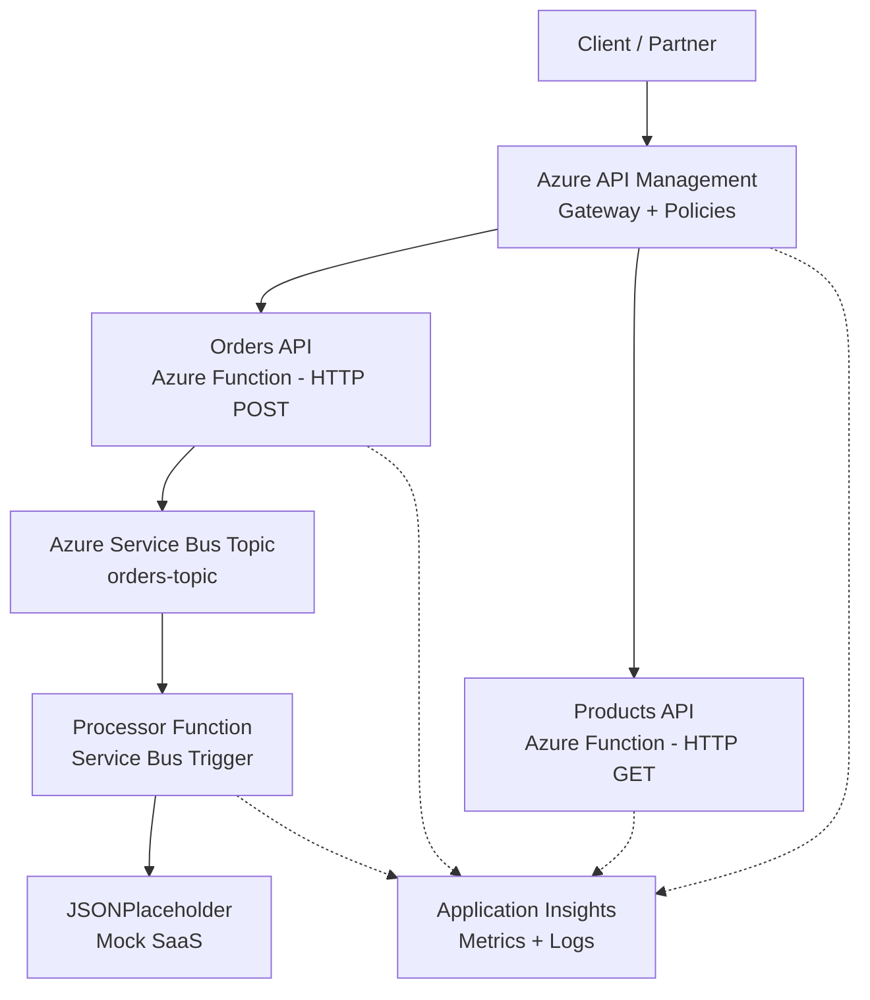

# OrderHub-APIM Design Spec

**Date:** 2026-04-25
**Status:** Approved

## Overview

OrderHub-APIM is a portfolio project demonstrating enterprise API management patterns on Azure. A fictitious e-commerce platform receives orders via a synchronous API (fronted by Azure API Management), applies gateway policies (rate limiting, caching, retry, transformation), publishes events asynchronously to Azure Service Bus for background processing, and integrates with a mock external SaaS. All infrastructure is provisioned with Terraform. Observability is handled by Application Insights.

## Architecture



## Project Structure

```
orderhub-apim/
├── terraform/
│   ├── providers.tf
│   ├── variables.tf
│   ├── main.tf
│   ├── outputs.tf
│   └── policies/
│       └── order-policy.xml
├── functions/
│   ├── host.json
│   ├── requirements.txt
│   ├── function_app.py
│   └── local.settings.json  (gitignored)
├── .gitignore
└── README.md
```

- Single `function_app.py` using Azure Functions v2 Python programming model (multiple functions in one file).
- Flat Terraform structure (no modules) — appropriate for this project scope.
- APIM policies in a separate `policies/` folder for clarity.

## Terraform Infrastructure

| Resource | Name Pattern | Details |
|---|---|---|
| Resource Group | `rg-orderhub-{random_pet}` | `brazilsouth` region |
| Storage Account | `storderhub{random_string}` | Required by Functions runtime. Uses `random_string` (lowercase alphanumeric — Azure requirement). |
| Application Insights | `ai-orderhub` | Web application type. Observability for all components. |
| Service Bus Namespace | `sb-orderhub-{random_pet}` | **Standard SKU** to support Topics + Subscriptions. |
| Service Bus Topic | `orders-topic` | Pub/sub for order events. |
| Service Bus Subscription | `processor-sub` | Processor function subscribes here. |
| Service Plan | `plan-orderhub` | Linux Consumption (Y1) — free tier. |
| Linux Function App | `func-orderhub-{random_pet}` | Python 3.12, v2 programming model. |
| API Management | `apim-orderhub-{random_pet}` | Developer_1 SKU. |
| APIM API — Orders | `orders-api` | Path: `/orders`, proxies to Function App `/api/orders`. |
| APIM API — Products | `products-api` | Path: `/products`, proxies to Function App `/api/products`. |
| APIM API Policy | per-API | XML policy files from `policies/` folder. |

Globally unique names (APIM, Function App, Service Bus) use `random_pet` suffix. Storage account uses `random_string`.

`variables.tf` parameterizes: location, publisher email, resource name prefix.
`outputs.tf` exposes: APIM gateway URL, Function App URL, App Insights instrumentation key.

## Azure Functions

Three functions in one `function_app.py`:

### create_order (HTTP POST /api/orders)

**Input payload:**
```json
{
  "customer_name": "João Silva",
  "product_id": "PROD-001",
  "quantity": 2
}
```

**Behavior:**
1. Validates required fields (`customer_name`, `product_id`, `quantity`).
2. Generates a UUID `order_id`.
3. Builds event: `{order_id, customer_name, product_id, quantity, status: "pending", created_at}`.
4. Publishes event to `orders-topic` on Service Bus.
5. Returns `202 Accepted` with `{order_id, status: "pending"}`.

### get_products (HTTP GET /api/products)

Returns a hardcoded list of mock products. No database.

```json
[
  {"id": "PROD-001", "name": "Wireless Mouse", "price": 29.99},
  {"id": "PROD-002", "name": "Mechanical Keyboard", "price": 89.99},
  {"id": "PROD-003", "name": "USB-C Hub", "price": 49.99}
]
```

### process_order (Service Bus Topic Trigger)

**Trigger:** Listens on `processor-sub` subscription of `orders-topic`.

**Behavior:**
1. Deserializes the order event from the message body.
2. POSTs to `https://jsonplaceholder.typicode.com/posts` with order data.
3. Logs success (`logging.info`) or failure (`logging.error`) — captured by Application Insights.

### Dependencies (requirements.txt)

- `azure-functions` — runtime
- `azure-servicebus` — publish to topic
- `requests` — call JSONPlaceholder

## APIM Policies

### Orders API Policy (order-policy.xml)

| Policy | Section | Behavior |
|---|---|---|
| `rate-limit` | inbound | 50 calls per 60 seconds per subscription |
| `cache-lookup` | inbound | Cache by query string |
| `retry` | backend | 3 retries, 2-second interval on backend failure |
| `cache-store` | outbound | Cache responses for 300 seconds |
| `set-header` | outbound | Adds `X-Processed-By: APIM-OrderHub` header |

Subscription key auth (`Ocp-Apim-Subscription-Key`) is handled natively by APIM via `subscription_required = true` (Terraform default).

JWT `validate-jwt` block included as a **commented-out example** with documentation explaining Entra ID wiring.

### Products API Policy

Simpler policy: rate limiting + caching only. No retry needed for a static GET.

## Observability

Application Insights captures automatically via Function App integration:

| Signal | Source | What it shows |
|---|---|---|
| Request traces | HTTP functions | Latency, status codes, throughput |
| Dependency calls | `process_order` → JSONPlaceholder | External call success/failure/duration |
| Custom logging | `logging.info()` / `logging.error()` | Order lifecycle events |
| Service Bus metrics | Azure platform | Queue depth, message count, dead-letter |
| APIM analytics | APIM resource | Requests by API, policy hits, error rates |

No custom dashboards or alerts provisioned in Terraform. Built-in APIM and App Insights dashboards are sufficient. README documents which blades to inspect.

Structured logging pattern:
```python
logging.info(f"Order {order_id} created, published to Service Bus")
logging.info(f"Order {order_id} processed, SaaS response: {status_code}")
logging.error(f"Order {order_id} SaaS call failed: {error}")
```

## README Structure

1. Overview — one paragraph
2. Architecture diagram — Mermaid (renders on GitHub)
3. Tech stack table
4. APIM Policies explained
5. Prerequisites — Azure account, Terraform, Azure CLI, Python 3.12
6. Quick start — `az login` → `terraform init` → `terraform apply` → deploy functions
7. API reference — endpoints, payloads, `curl` examples with subscription key
8. Async flow — Service Bus topic → processor → SaaS
9. Observability — which blades to check, what to look for
10. Project structure — tree with descriptions
11. Cleanup — `terraform destroy`

## Out of Scope

- CI/CD (GitHub Actions) — can be added later as iterative improvement.
- Database — orders are fire-and-forget; products are hardcoded.
- Real identity provider — subscription keys for demo, JWT as documented reference.
- Terraform modules — flat structure is appropriate for this size.
- Postman collection — `curl` examples in README instead.
